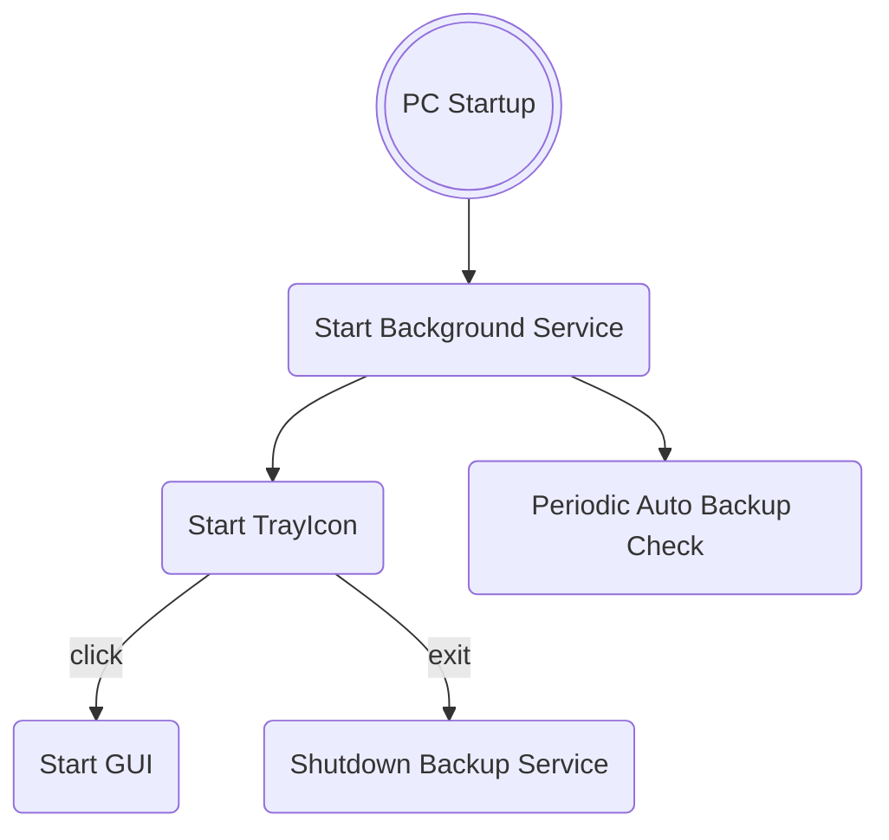

# Backup Manager

**Backup Manager** is a user-friendly program with an intuitive graphical interface, designed to simplify and automate the backup of folders and subfolders. Users can configure a custom time interval between automatic backups, setting the desired number of days between each operation. Additionally, manual backups can be performed at any time, providing maximum flexibility.

Each backup is carefully saved, and the program maintains a detailed log of all completed operations. Users can also view, manage, and edit the details of each backup, ensuring complete control and customization over saved data. This tool is an ideal solution for efficiently and securely protecting files, minimizing the risk of data loss.

## Screenshots

## Startup Logic

## Important Notes:
* If, for any reason, the setup program doesn't add the application to the startup registry (`regedit`), you can manually run "add_to_startup.bat" located in the installation folder by double-clicking it.
* This program is set to run automatically at PC startup by default. If you disable it, automatic backups will no longer occur.

## Platforms

| Platform | Availability |
| --- | --- |
| Windows | ✅ |
| Linux | ❌ |
| MacOS | ❌ |

## Supported Languages

| Piattaforma | Availability |
| --- | --- |
| English | ✅ |
| Italian | ✅ |
| Spanish | ✅ |
| German | ✅ |
| French | ✅ |

## Licence

## Time report

## Authors

- [DennisTurco](https://www.github.com/DennisTurco)

## Support

For support, email: dennisturco@gmail.com